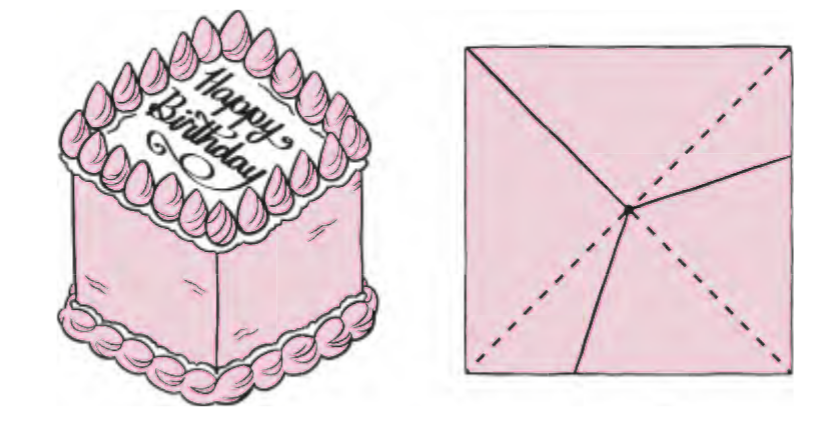

## Solution: Cake Division 

You can get any number k of pieces with the same amount of cake and the same amount of icing in the following neat way: Looking at the cake from above, divide the perimeter of the square top of the cake into k equal parts and make straight, vertical cuts to the middle of the square from each boundary point on the perimeter. That works because each piece, looked at from the top, is the union of triangles with the same altitude (namely, half the side of the cake) and the same total base (namely, 1/k times the perimeter), as in the figure below.

An alternative solution for the case of 3 pieces is to divide the cube into 27 equal pieces (arranged in a 3×3×3 grid like a Rubik's cube), then group these 27 pieces into 3 collections of 9 cubes each, ensuring that each collection has the same total amount of icing.

## Solution: Efficient Pizza Cutting

Note that the nth cut can at best cross each of the $n−1$ previous cuts, and between each pair of crossings, split a previous piece in two. Since you also get a new piece before the first crossing and after the last one, the cut ends up adding n new pieces. It follows that with n cuts you can create at most $1 + 2 + · · · + n = n(n+1)/2$ new pieces, but remember you started with one piece (the whole pizza), so the answer is $1 + n(n+1)/2$ pieces. For 10 slices, that works out to 56 pieces.

Wait, we haven’t actually shown that you can achieve that many
pieces—that would require having every two cuts cross, with never any more than two cuts crossing at the same place. But if we just mark $2n$ random points along the edge of the pizza, number them clockwise (say) and cut from the first to the $n+1$ st, then the second to the $n+2$ nd, etc., then every two cuts will cross, and the probability of three cuts intersecting at the same point would be 0. So we’ll get what we want with probability 1.